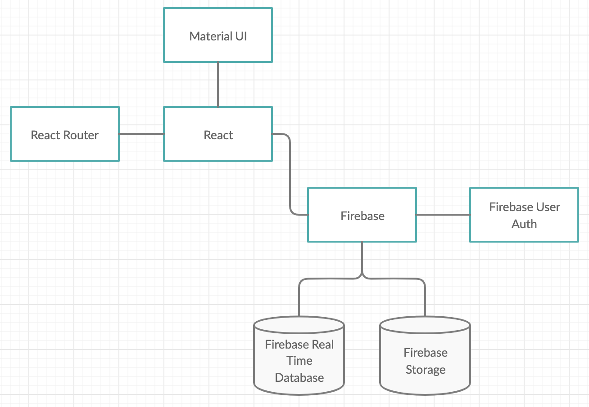

# Overall Architecture Design
- Frontend: React, Javascript, and Material UI
- Backend: No backend, just firebase
- Datastore: Firebase (real time database) and firebase storage (Web, JS)
- Deployment: via firebase deployment

# Database Schema

- The database itself is a NoSQL database, with the entire data store is separated out into four “tables”: 
- Artworks
  - An object composed of unique Ids, each of which contains:
    - All strings: artist, imageLine, dimensions, description, materials, name, objectNumber, year
    - A unique Id, a string
    - An image id, a string (that references the image bucket in firebase storage)
    - A list of contextual medias, an object that contains contextual media unique ids that can reference an object in contextual media
- Contextualmedia
  - An object composed of unique Ids, each of which contains:
    - All strings: description, name, unique id
    - An image id, a string (that references the image bucket in firebase storage)
- Projects
  - An object composed of unique Ids, each of which contains:
    - A list of artworks (which contain unique Artwork ids, which can be found in the artworks object)
    - a list of collaborators (which contain user emails, which can be found in the users object)
    - The same unique id for the project
    - The name of the project, a string
    - The owner, a unique Id found in the users object
- Users
  - An Object composed of unique ids, each of which contains:
    - Email: a string
    - Username: a string
    - Projects object that contains a list of project Ids, each of which can be found in the projects object

# Database Storage Schema (Images)
- Artworks/ (for artwork images)
- Contextualmedia/ (for contextual media images)
- projects/ (for project cover photos)
- samples/ (for testing)

# Design Justification for Primary Design Decisions

## Issue: what frontend framework to use?

- Choice: React
- Justification: React is a popular framework with a lot of support, which will let our client continue work onour project after the semester ends.
- Alternatives: Angular, plain Javascript
- Trade-offs: Our group isn't too familiar with React, so plain Javascript might be easier. However, writing in plain Javascript is not very scalable.
- Assumptions: Assuming our group has the ability to learn React and adapt to any React bugs.
- Dependencies: N/A

## Issue: what backend framework to use?

- Choice: No backend — just Firebase
- Justification: Backend-wise, our app mostly just retrieves and stores data. There's no use for a production - backend since we don't need to modify the data.
- Alternatives: Using a backend
- Trade-offs: It will be very difficult to transition to a backend if we need one in the future
- Assumptions: There will be no need to use a backend in the future
- Dependencies: Firebase can store all the information we need it to store

## Issue: what method of application deployment did we use?

- Choice: VCM (formerly heroku)
- Justification: After encountering issues with heroku deployment due to Javascript heap out of memory issues, we switched our method of app deployment to a VCM.
- Trade-offs: The domain name is no longer pretty (just an IP address) as compared to a herokuapp.com subdomain. Meanwhile, though, it seems to be a bit more stable as compared to heroku as we have not had much trouble hosting it there
- Assumptions: We assumed that VCM was an easier platform to be able to push out our master branch features with less overhead
- Dependencies: CI/CD pipeline is not as straightforward with a VCM deployment as opposed to heroku (in heroku, just do git push heroku master to deploy, whereas for the VCM, we would need to pull from the master branch of the repo)

## Issue: What styling?

- Choice: Nasher-themed. Material-UI react components. Custom carousel component.
- Justification: Our app should match the aesthetic of the Nasher Museum. Using a pre-built component library allowed rapid feature implementation. No pre-built carousel components could be found that met our requirements, so a custom solution was utilized.
- Alternatives: Various other component libraries.
- Trade-offs: Using pre-built components forces the developer to work within the constraints of those components, or build from scratch, which takes time.
- Assumptions: Material-UI components would be easy to integrate
- Dependencies: Material-UI

## Issue: What type of application to build?

- Choice: Web application
- - Justification: We chose ultimately to pursue a web application primarily because most of us had more web application experience, and we believed that using a web application would be more scalable and applicable to a variety of use cases in the Nasher (for example, as display on exhibits, as well as used as a teaching tool by curators, browsing and uploading artworks to exhibits).
- Alternatives: Building a mobile application
- Trade-offs: There is less ability to “lock down” the web application and ensure that visitors to the Nasher do not break out of the application and poke at other features on the device. Perhaps some features would work less well on a mobile device since it is not a native application to the device
- Assumptions: We assumed that our members were willing and had some relevant experience with web development, and that a web application had more use cases in the Nasher than a mobile application would.
- Dependencies: Quite obviously, this was a big design decision that ultimately very much impacted all the other decisions we took (for example styling, choice of front end and back end frame works, data storage, user authentication, etc.)

## Issue: What type of user authentication would work the best?

- Choice: Sign in on via email and password
- Justification: Our justification for signing on via email and password was that we wanted to build a minimal viable product that still preserved basic functionality of allowing users (curators) to store their particular projects as well as state and identity.
- Alternatives: Google sign in, Facebook sign in, Shibboleth (Duke)
- Trade-Offs: Some of the other options, notably Shibboleth, are more familiar to the users. This is a stretch goal for the project, however since it requires significantly more development and set up than the simple email sign-up, we elected to push this type of authentication to a later sprint, since our discussions with the client revealed that having a basic functional product was preferred.
- Assumptions: We assume that users have emails and have a way to remember/store their passwords
- Dependencies: This impacted the way we constructed our data store and how users can access different projects/artworks based on their permissions.